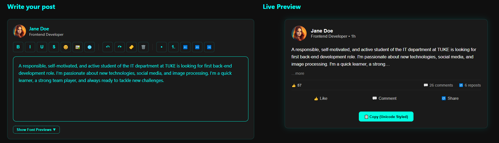

# ✨ Linkedin Text Formatter

🚀 Format, preview, and beautify your LinkedIn posts - like a pro!  
Live preview, emoji support, rich formatting, hashtag styling and more… all in one sleek dark-themed app.



---

## 🔍 Features

✅ Rich text editor (Bold, Italic, Lists, Align, Emoji, Images, Links)  
✅ Live preview that mimics LinkedIn's layout  
✅ Hashtag highlighting (`#example`)  
✅ Emoji picker  
✅ Custom fonts panel (preview how your text looks in 10+ fonts)  
✅ Clear formatting, Undo/Redo, Reset  
✅ Mobile responsive

---

## 🧰 Tech Stack

- ⚛️ React 19
- 💨 Vite
- 🧼 DOMPurify (for safe HTML)
- 🎨 CSS Modules / Custom Dark Theme
- 📦 TypeScript
- ☁️ GitHub Pages

---

## 🛠️ Getting Started

```bash
git clone https://github.com/Antot-12/Linkedin-Text-Formatter.git
cd Linkedin-Text-Formatter
```

```bash
npm install
npm run dev
```

Open http://localhost:5173 to view in your browser.

---
